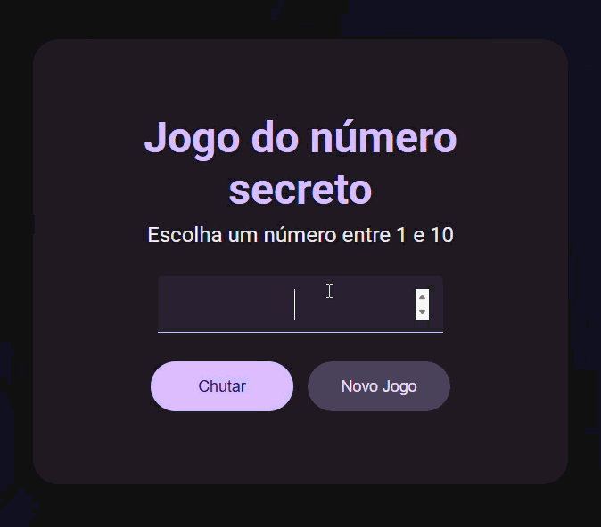

# Número Secreto em JavaScript

Descobra o número secreto, esse projeto foi feito ultilizando o material incluido no curso: Lógica de Programção com Javescript da Alura

## Roadmap

| Adicões | Status |
| --- | --- |
| Mudar o visual para material design | Feito |
| Adicionar animação de acerto | Feito |
